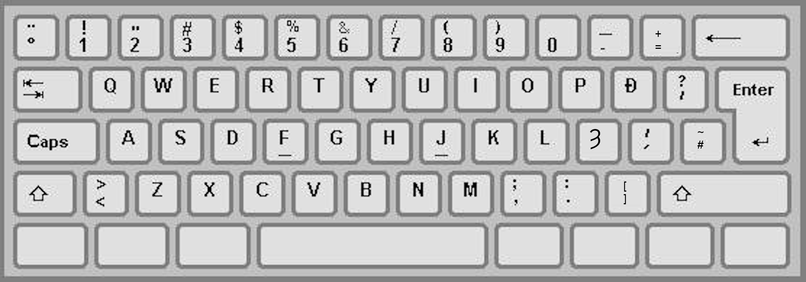

# scotkb

An attempt to make a standard keyboard layout for Scots, with at least Yogh 
and possibly Eth.

## Rationale

Scots uses a letter, yogh (&yogh;, &Yogh;), which is not present in the modern 
English alphabet. Since the late medieval period, printers in Scotland tended 
to buy their type from typefounders in England, who did not include &yogh;.
Consequently, it has become common practice to use 'z' in
place of &yogh;, which leads to confusion in the pronunciation of many words
and, in particular, in names such as

* Cocken&yogh;ie
* Dal&yogh;iel
* Men&yogh;ies
* &Yogh;etland

If you think that native Scots speakers pronounce these words strangely, this 
is probably why.

As modern computers are perfectly capable of displaying the &yogh; glyph, it 
seems sensible to make it convenient for Scots users to have a keyboard layout
which makes it convenient to type it.

Additionally, this keyboard layout contains eth (&eth;, &Eth;), since medieval
Scots used &eth; and its use also affects the pronunciation of some names. 
Since &eth; is not (to my knowledge) used in modern Scots, the final layout may
not include this letter.

## Awful warning

I do not fully know what I'm doing, and am mainly working by hacking Icelandic
keyboard layouts. Consequently at this moment the layout still contains some
glyphs which are used in Icelandic but not in Scots, and the layout of 
punctuation keys is not optimised for Scots use.

This is experimental, unstable and may not work.

## Unix

The files provided in the `unix` subdirectory are adapted from Ubuntu 20.04 LTS;
they should be fairly similar to equivalent files in other Un*x/Linux 
distributions, but YMMV. 

In particular I should provide scripts to modify 

* `base.lst` 
* `base.xml`
* `evdev.lst` 
* `evdev.xml`

but I have not yet written those.

## Macintosh

Nothing yet, expected soon.

## Windows

Nothing yet, expected soon.

## License and copyright

Copyright &copy; Simon Brooke 2022. Licensed under 
[Creative Commons Attribution/Share Alike](https://creativecommons.org/licenses/by-sa/4.0/) terms.
